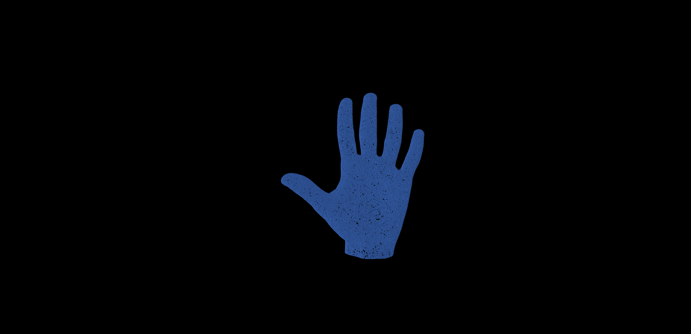

##  Agent-based 3D Modeling Toolkit

This toolkit aims to support complex 3D simulation with agent-based models in NetLogo. 

### Functions 

- Import 3D Model into NetLogo
- 3D Agent Visiting
- 3D Model Scanning
- 3D Particle Collision
- Infrared 3D Data Rendering

### Screenshot

More animation videos can be found in [our Youtube playlist](https://www.youtube.com/playlist?list=PLzHAI-8E5tBCPq3QCMmZdYaxIW-93fa5N ).

### Experiments

#### 3D Model Loading (Click pictures for animation videos)

#### 3D Model Scanning

#### 3D Particle Collision

### Infrared 3D Rendering for hand

### Infrared 3D Rendering for human body

## License

MIT

